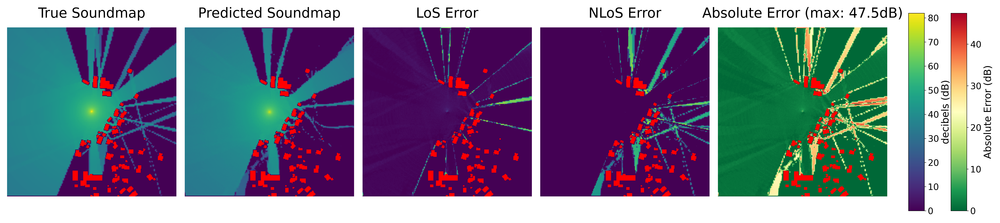

# Full-Glow for Urban Sound Maps

This repository contains an adapted implementation of Full-Glow for urban sound map generation. It is based on [Full-Glow: Fully conditional Glow for more realistic image generation](https://arxiv.org/abs/2012.05846).

The original Full-Glow model has been modified to work with sound map data, allowing for the generation of sound maps from building layouts while considering acoustic and environmental conditions like temperature, humidity, and noise levels.

## Training Progress

The following animation shows an example of the training progress of the reflection model over 1.2 million iterations and 108 hours of training, condensed into **10 seconds**. It illustrates how the network learns to capture reflections in the generated sound maps


## Reflection Evaluation

Below is a example visualization comparing the generated sound maps with reference data. The image highlights the evaluation of reflections in an urban environment.



## Project Context

This implementation was developed as part of a bachelor's thesis at Stuttgart Media University (HdM) within the research project [KI-Bohrer](https://www.ki-bohrer.de/) at Offenburg University of Applied Sciences, funded by the BMBF. The goal was to evaluate the physical correctness of normalizing flows for image-to-image transformations in sound propagation simulations.

### Key Results

- **Baseline**: NLoS-MAE 0.65 (45% improvement), LoS-MAE 1.84
- **Diffraction**: NLoS-MAE 2.63 (19% improvement), LoS-MAE 0.79
- **Reflection**: NLoS-MAE 3.64 (24% improvement), LoS-MAE 2.06
- **Combined**: NLoS-MAE 9.68, LoS-MAE 9.53

## Evaluation Metrics

The evaluation script calculates several metrics:
- **MAE (Mean Absolute Error):** Average absolute difference between predicted and true values
- **MAPE (Mean Absolute Percentage Error):** Average percentage difference between predicted and true values

### Line of Sight (LoS) Metrics:
- **LoS_MAE:** MAE for areas with direct line of sight to the sound source
- **NLoS_MAE:** MAE for areas without direct line of sight
- **LoS_wMAPE:** Weighted MAPE for visible areas
- **NLoS_wMAPE:** Weighted MAPE for non-visible areas

## Environment Setup

1. Create a new virtual environment:
```bash
python -m venv venv
source venv/bin/activate  # On Windows use: venv\Scripts\activate
```

2. Install required packages:
```bash
pip install -r requirements.txt
```

## Model Architecture

The model uses the Full-Glow architecture which extends the original Glow model by making all operations conditional. When environmental conditions are enabled, they are incorporated into the conditioning networks alongside the building layout information.

Key features:
- Fully conditional flow-based model
- Support for multiple environmental conditions
- Support for combining image and numerical conditions
- Generates 256x256 sound maps
- Uses LU decomposition for improved stability (when enabled)
- Gradient checkpointing for memory efficiency

## Training Commands

All training commands use the same base structure. The only difference is the enabled conditions:

### Training Parameters

- `--n_flow`: Number of flow steps per block (default: [8, 8, 8, 8])
- `--n_block`: Number of blocks (default: 4) 
- `--img_size`: Image dimensions (default: [256, 256])
- `--batch_size`: Batch size for training (default: 1)
- `--lr`: Learning rate (default: 1e-4)
- `--temperature`: Sampling temperature (default: 1.0)
- `--do_lu`: Enable LU decomposition for invertible 1x1 convolutions
- `--grad_checkpoint`: Enable gradient checkpointing to reduce memory usage
- `--use_temperature`: Enable temperature conditioning
- `--use_humidity`: Enable humidity conditioning
- `--use_db`: Enable decibel level conditioning

### Example Commands

Baseline Model (no conditions):
```bash
python main.py --model glow_improved --dataset soundmap --direction building2soundmap --img_size 256 256 --n_block 4 --n_flow 8 8 8 8 --do_lu --reg_factor 0.0001 --grad_checkpoint
```

Combined Model (all conditions):
```bash
python main.py --model glow_improved --dataset soundmap --direction building2soundmap --img_size 256 256 --n_block 4 --n_flow 8 8 8 8 --do_lu --reg_factor 0.0001 --grad_checkpoint --use_temperature --use_humidity --use_db
```

## Evaluation Tools

The repository includes several evaluation scripts:

```
src/
├── analyze_checkpoints.py       # Analyze training checkpoints
├── analyze_logs.py             # Analyze training logs
├── condition_analysis.py       # Analyze conditioning impact
├── dataset_analyzer.py         # Dataset statistics
├── model_analysis.py           # Architecture analysis
├── sound_metrics.py           # Basic metrics (MAE, wMAPE)
├── sound_metrics_improved.py   # Enhanced metrics (SSIM)
├── temperature_test.py        # Temperature parameter study
├── training_analysis.py       # Training process analysis
├── validate_soundmaps.py      # Validation tools
└── create_training_gif.py     # Training visualization
```

Example evaluation command:
```bash
python sound_metrics_improved.py --data_dir <test_data> --pred_dir <predictions> --output_dir <output> --model_type <model_type>
```

## Citation

If you use this code, please cite both this adaptation and the original Full-Glow paper:

```
@bachelorthesis{eckerle2024fullglow,
    title={Evaluierung der physikalischen Korrektheit von Normalizing Flows bei Bild-zu-Bild-Transformationen in Schallausbreitungssimulationen},
    author={Eckerle, Achim},
    year={2024},
    school={Hochschule der Medien Stuttgart}
}


@inproceedings{sorkhei2021full,
  author={Sorkhei, Moein and Henter, Gustav Eje and Kjellstr{\"o}m, Hedvig},
  title={Full-{G}low: {F}ully conditional {G}low for more realistic image generation},
  booktitle={Proceedings of the DAGM German Conference on Pattern Recognition (GCPR)},
  volume={43},
  month={Oct.},
  year={2021}
}
```

## License

MIT